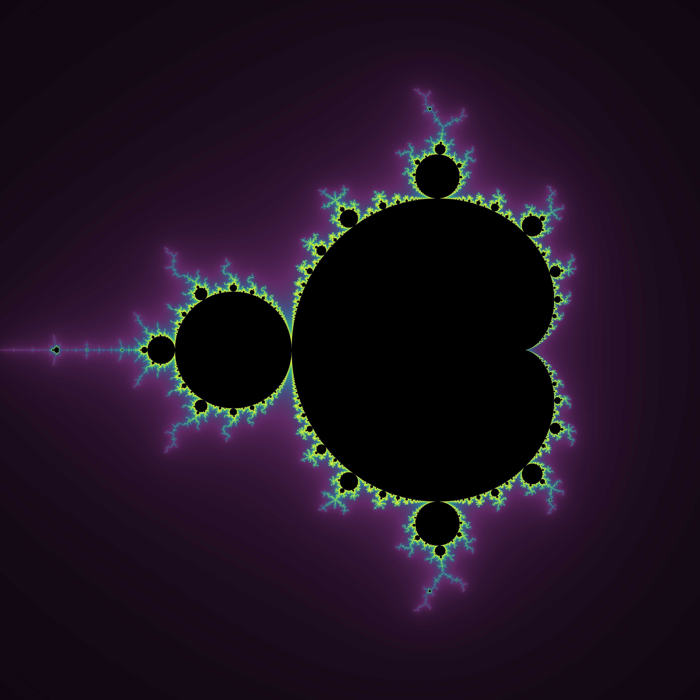
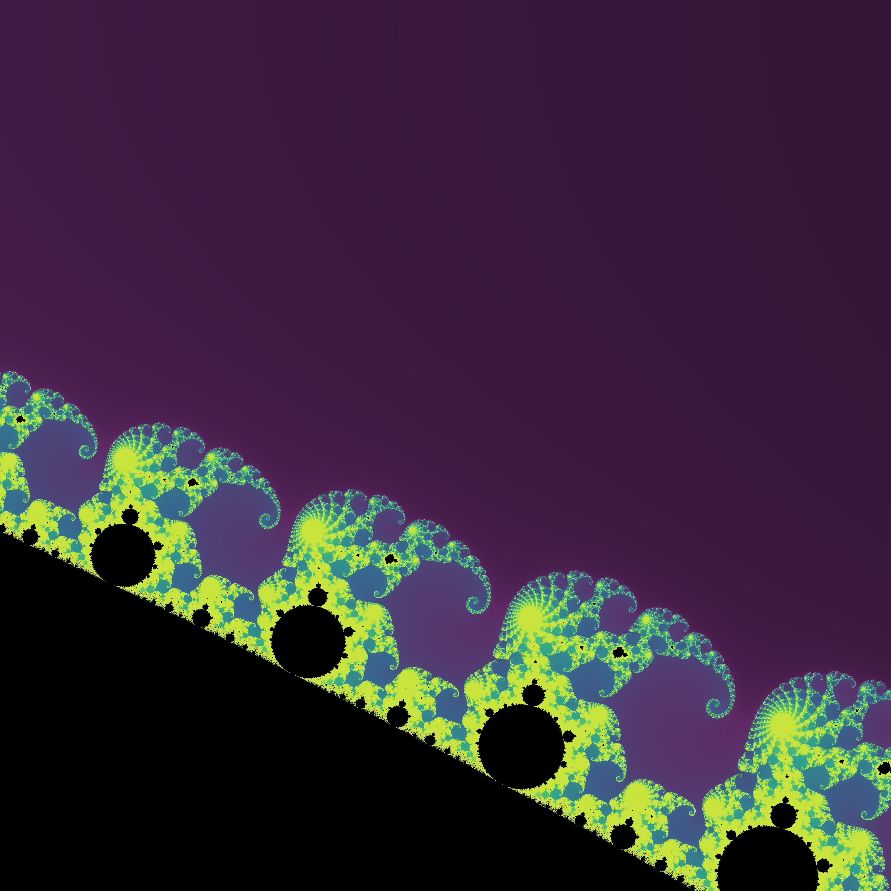

# py-mandelbrot
Mandelbrot set visualisation written in Python and accelerated with PyCUDA

## Prerequisites
 - Python 2.7+ or Python 3+
 - Pillow
 - PyCUDA (optional, for CUDA compatible devices)
 - PyQt 4 or 5 (optional, for GUI)

## Usage
`python mandelbrot.py [-h] [--size SIZE] [--plane PLANE] [--tasks TASKS] [--output OUTPUT] [--quiet QUIET] [--mode MODE]`

### Arguments

__--size SIZE, -s SIZE__

_Description:_ The output image size, example format: 500x500

_Default:_ 500x500

__--plane PLANE, -p PLANE__

_Description:_ The real and imaginary axis range, example format: -2.0:1.0:-1.5:1.5, where [-2.0, 1.0] is the real axis range and [-1.5, 1.5] is the imaginary axis range.

_Default:_ -2.0:1.0:-1.5:1.5

__--tasks TASKS, -t TASKS__

_Description:_ The number of concurrent CPU tasks to generate the visualisation.

Default: 1

__--output OUTPUT, -o OUTPUT__

_Description:_ The output filename.

_Default:_ mandelbrot.png

__--quiet QUIET, -q QUIET__

_Description:_ Quiet mode (no verbose logs)

_Default:_ 0 (verbose)

__--mode MODE, -m MODE__

_Description:_ 0 for GUI, 1 for console mode

_Default:_ 0 (GUI)

__--gpu GPU, -g GPU__

_Description:_ GPU acceleration mode if set to 1 (true). Only available when there is a CUDA-capable device and PyCUDA is installed. If set to 0 (default), the script runs in CPU acceleration.

_Default:_ 0 (CPU)

## Custom color scheme

You can also create a custom color scheme that will be used in the visualisation.

Simply change the COLOR_PALETTE list in the `other/generate_color_scheme.py` script with five or more main colors you would like to use and run:

`python other/generate_color_scheme.py [COLORS]`

where `[COLORS]` is the number of colors you want to generate (_default:_ 512). Typically it should be equal to the `MAX_ITERATIONS` constant in `mandelbrot/constants.py`.

## Examples

Other sample images can be found in `screens` directory.

### Seahorse valley

__Command used:__ `python mandelbrot.py -m 1 -g 1 -s 4096x4096 -p="-0.78:-0.76:-0.12:-0.10" -o seahorse_valley.png`

### Elephant valley

__Command used:__ `python mandelbrot.py -m 1 -g 1 -s 4096x4096 -p="0.27:0.28:0:0.01" -o elephant_valley.png`

### Mini Mandelbrot

__Command used:__ `python mandelbrot.py -m 1 -g 1 -s 4096x4096 -p="-1.79:-1.71:-0.04:0.04" -o mini_mandelbrot_2.png`
